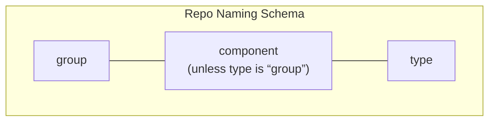
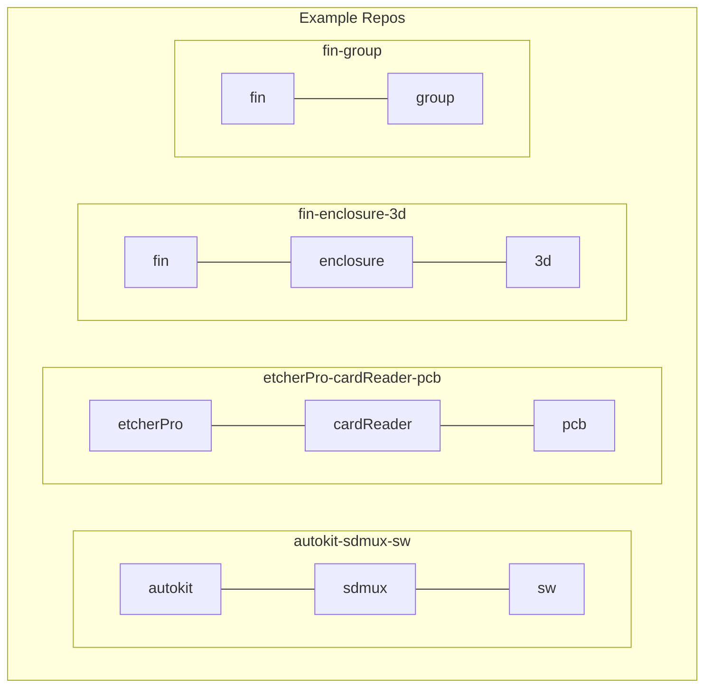

# Naming Product Repos

When creating new product repos (on GitHub), repo names should follow a standard schema.
There are more than 100 repos in the org, so this helps to understand at a glance what is in each repo and how they support each other.

### Table of Contents

-   [Definitions](#definitions)
    -   [Groups](#groups)
        -   [Group Repos](#group-repos)
    -   [Components](#components)
    -   [Type](#type)
-   [Schema](#schema)
    -   [Creating a new product](#creating-a-new-product)
-   [Examples](#examples)

---

## Definitions

### Groups

Repositories are organised into **groups** and are named accordingly.
A **group** is either a product name, or one of the following non-product groups:

- `general`: for repositories that do not belong to a single product **and** are standalone.
             This applies to self-contained work that is designed to suit multiple products.
             On the other hand, if a repository belongs to a single product, it should go in that product's group.
             If it is not standalone, then a new group should be created and all associated repositories added to the new group.
             The current list of repositories in the `general` group can be found [here](https://github.com/balena-io-hardware/general-group).
- `meta`:    for repositories that are concerned with repositories.
             This includes repository templates, software that automates repository actions and documentation on how to work with respositories.
             For example, this document belongs to repository in the `meta` group.
             The current list of repositories in the `meta` group can be found [here](https://github.com/balena-io-hardware/meta-group).

#### Group Repos

To further aid organisation, every group has a **group repo** which contains only a directory of the repositories within that group.
As well as making navigation easy, the group repo provides opportunities for manual and automated curation of the intellectual property within a group.
Potential use cases include exporting design files for third parties, or building a bill of materials for distribution.

Group repos also provide a central place for data collection, prior to the identification of specific components.
For example, the [mrpeasy-group](https://github.com/balena-io-hardware/mrpeasy-group) can be used to collect all Issues associated with our implementation of MRPeasy, since a set of useful "components" is not clear at this stage.
If that situation changes, it is easy to move issues between repositories when they are organised in this fashion.

Additionally, there is one special group repo - the `groups-group` - which consists only of repositories that are themselves group repos.
This provides a top-level entry point to all repositiories within the organisation.
It can be found [here](https://github.com/balena-io-hardware/groups-group).

### Components

Repositories are concerned with a single **component**.
That may be a piece of software, a user manual, a PCB or any other single design artefact.
It is important to limit the concern of a repository to a single component, both because it aids in organisation of repositories but also because much of the automation and version control mechanisms are designed with sets of single concern respositories in mind.

### Type

To make the artefact of a single concern repository explicit, each is marked with a **type**.
This helps distinguish repositories, understand how repositories are related to one another, and ensure the purpose of repository remains clear.

The type specified is free-form and new types can be created freely.
However, by convention, the following list of types has been established and defined.
Therefore it is recommended that one be selected from this list except in exceptional circumstances.

- `doc`: a repository that builds to a website, document or other artefact used by humans for documentation purposes
- `2d`: a 2D drawing
- `3d`: a 3D CAD model
- `group`: reserved for [Group Repos](#group-repos)
- `pcb`: a PCB project
- `project`: a repository primarily used for the GitHub Projects feature
- `sw`: a repository that builds an executable, or is otherwise runnable by a machine
- `template`: a repository that is designed to be the starting point for another repository

---

## Schema

When naming product repos you should:

1. Specify the group, component and type, separated with a hyphen (-). For example: `etcherPro-enclosure-3d` (see examples diagram)
    1. The only exception are [Group Repos](#group-repos), which by definition have no component. For example: `etcherPro-group`.
1. Use lower case where possible, when multiple words are required use lower camel case, e.g. `fin-flashingJig-3d`
3. Do not use spaces
4. Do not use special characters (e.g. `_`,`$`,`@`)

### Creating a new product

When creating a new product, the product builder should start with a group repo and use this to organise the component repos.
It is encouraged to use the README.md of the group repo to reflect the product's saga and be used to explain the what, why and how this product is constructed.

---

## Examples

