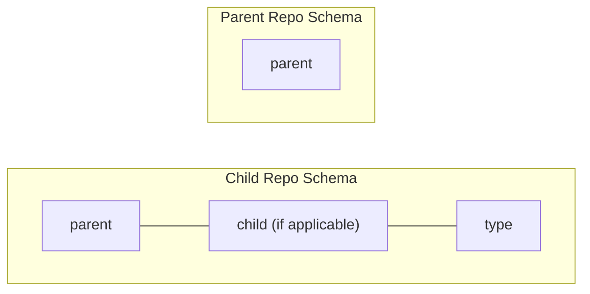
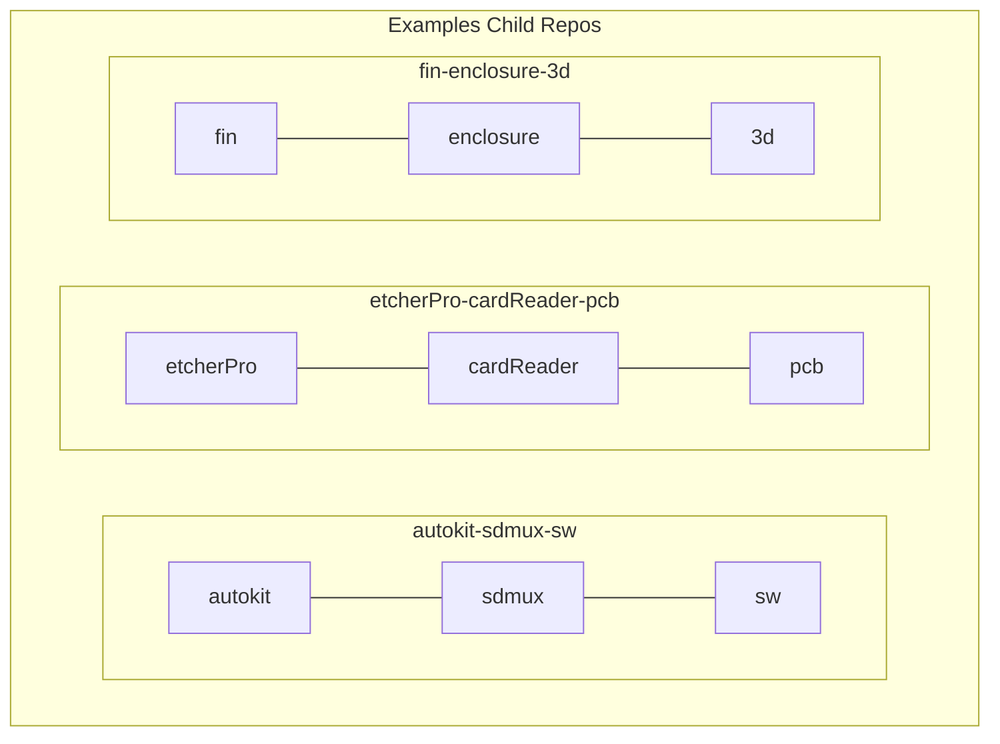

# Creating Product Repos

When creating new product repos (on GitHub), repo names should follow a standard schema.

## Schema

When naming product repos you should:

1. Use lower case where possible, when multiple words are required use camel case, e.g. `fin-flashingJig-3d`
2. Separate with a hyphen (-), e.g. `etcherPro-enclosure-3d`, (see examples diagram)
3. Do not use spaces
4. Do not use special characters (e.g. `_`,`$`,`@`)
5. The top-most parent should be the product name, e.g. `fin`; however it should not contain any source material of its own, only point to children repos. There should only be one top-most parent.

Types or product types, are loosely enforced, with the understanding that it is very difficult to predict all of the different (and future) types of repo.
Some suggested types are:

- Printed Circuit Board - `pcb`
- Software - `sw`
- Case - `3d` (where the child specifies that it is an enclosure)

### Creating a new product

When creating a new product, the product builder should start with a top-most parent repo and use this to organise the children repos.
It is encouraged to use the README.md of this parent repo to reflect the product's saga and be used to explain the what, why and how this product is constructed.

## Examples

