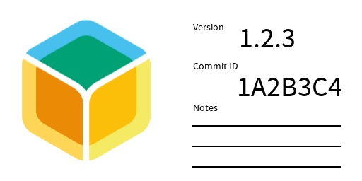

# Versioning

It is important to version your changes and we have a standard way of doing that across all your projects.

## Change type in commit messages

Whenever we open a new pull request on GitHub, we add one or more commits to it.
At least one of those commits should have one of the following strings below the commit message.

1. `Change-type: major`
2. `Change-type: minor`
3. `Change-type: patch`

A major change is one in which the hardware or software is no longer compatible with the older versions.
For example if we create a new version of the Fin which is not compatible with any of the Fin v1.x cases, then that would be a major change.

A minor change is one in which the hardware or software is still compatible with a previous version of the project.
So we are maintaining the major version of the project but are still creating some minor changes.
For example we could support everything on the Fin 1.1 and add some new features, in which case it would be called Fin 1.2.

A patch change is a bug fix.
That means you are changing something where all the features are the same, but you are fixing a bug.
For example if we find an issue with the Fin 1.1 USB circuitry, and we fix it in the future versions of the fin it would be called Fin 1.1.1

You can [read more](https://semver.org/) about this style of versioning - known as semantic versioning.
This is also what we use for all kinds of software at Balena.

### Examples

[Marek Koza](https://qyx.krtko.org/conceptual/hardware-semantic-versioning.html#adopting-the-semver-2-0-0-standard-for-hardware) has written some good examples of the above types of changes for the hardware.

Another example of how to do semver for firmware is elaborated in [this post by memfault](https://interrupt.memfault.com/blog/release-versioning#semantic-versioning).

## Considerations when prototyping

The following section deals with specifics of different types of projects when you are working on it in a pull request.
The final versioning of your changes will happen when it gets merged into master, but till then you will still be assigned a working version number, and some more meta data.

### PCB

When you create a new pull request or a project, especially a PCB one, you should put the version information on the silkscreen.
This will help the users of the particular PCB project identify what board they have - useful for reading documentation or getting support.
You should **NOT** add the version number directly to the silkscreen manually.
There might be more than one person working on a particular project, and they might have changes that get merged into the project before you.
That can create an inconsistency in the versioning - if done manually.

The right way to go about doing this is to add a variable to your Altium or KiCad project, and then place that on the PCB.
The hardware CI will generate the version number for your pull request and substitute that on the generated gerbers.

For prototype PCBS, there will be another variable along with the version variable mentioned above.
This will be the commit ID of your changes.
You should ensure that you have space on your PCB for this variable as well.

So in total, you will ensure that your silkscreen has 2 variables

1. Version variable - which will look like `v1.3.4`
2. Commit ID variable - which will look like `234e3e0`. It will always be a 7 digit alphanumeric string

When the changes get merged into the master branch and a final release is created, the commit ID variable won't be populated.

### Other projects

For other projects that don't have the option of putting the version information as part of the design - we will use stickers.

## Further reading

- Semver is a project in itself. We can create issues on their project repo in case we want additional clarifications.
For example, see [this thread where folks are discussing how to version software that depends on hardware](https://github.com/semver/semver/issues/707)
- Some other folks have [created forks of semver](https://files.ettus.com/manual/page_semver.html) to help with versioning hardware drivers and such. We could decide to do something like this. 
When doing this we should ensure that the cost of creating and maintaining a fork is less than the cost of living with whatever shortcomings we find with semver for hardware.
- One can optionally do prerelease tags with semver as well.
This is elaborated in [this post from memfault](https://interrupt.memfault.com/blog/release-versioning#pre-release-tag-best-practices)
