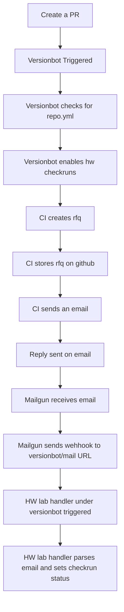

# Processes Overview

The hardware loops relies on a lot of processes to manage the complexity. We have made an attempt to document that in the diagram below.

[Source for the diagram](https://docs.google.com/drawings/d/1UYh5VfTJEuB8VCKdgM0RBZHtQcYBXavk9bzItHL82T0/edit)
