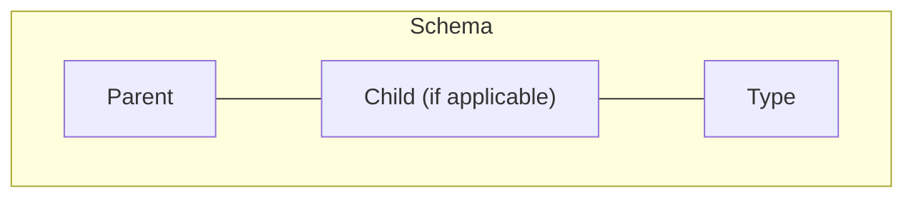
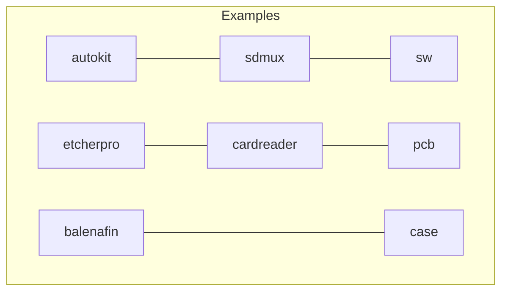

# Creating Product Repos

When creating new resources, such as repos, directories or manuals, repo names should follow a standard schema.

## Schema

When naming product repos you should:

1. Only use lower case
2. Separate with a hyphen (-), e.g `etcherpro-case`
3. Do not use spaces
4. Do not use special characters (e.g. `_`,`$`,`@`)

Types are loosely enforced, understanding that it is very difficult to predict all of the different types of repos.
Some suggested types are:

- Printed Circuit Board - `pcb`
- Software - `sw`
- Case - `case`
- Heat sink - `mech`

## Examples

