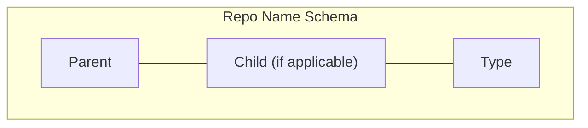
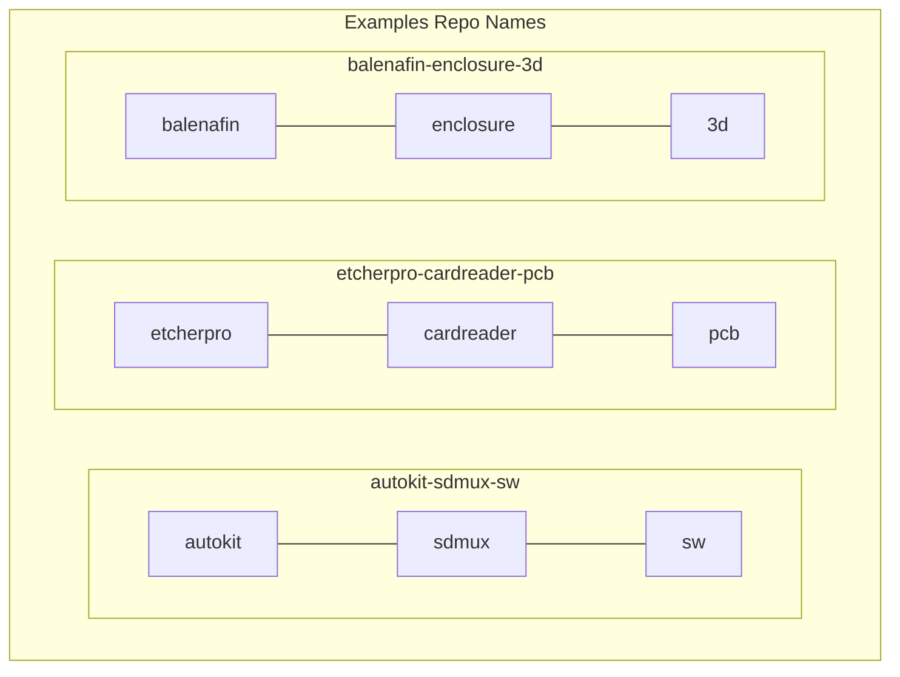

# Creating Product Repos

When creating new product repos (on GitHub), repo names should follow a standard schema.

## Schema

When naming product repos you should:

1. Only use lower case
2. Separate with a hyphen (-), e.g `etcherpro-enclosure-3d`, (see examples diagram)
3. Do not use spaces
4. Do not use special characters (e.g. `_`,`$`,`@`)

Types or product types, are loosely enforced, with the understanding that it is very difficult to predict all of the different (and future) types of repo.
Some suggested types are:

- Printed Circuit Board - `pcb`
- Software - `sw`
- Case - `3d` (where the child specifies that it is an enclosure)

## Examples

